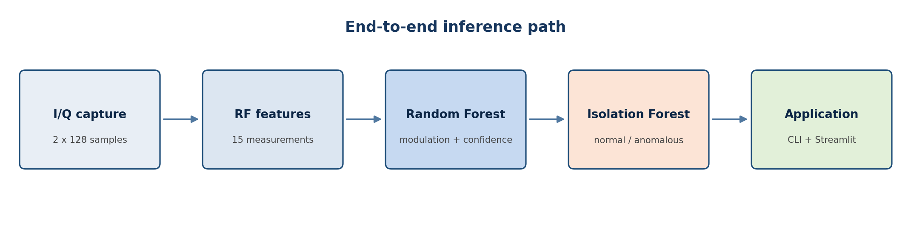
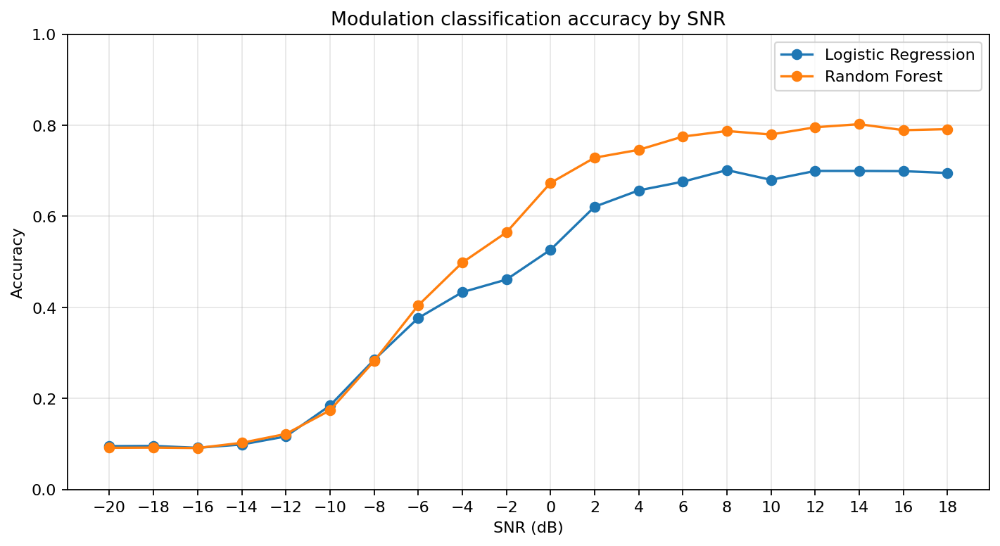
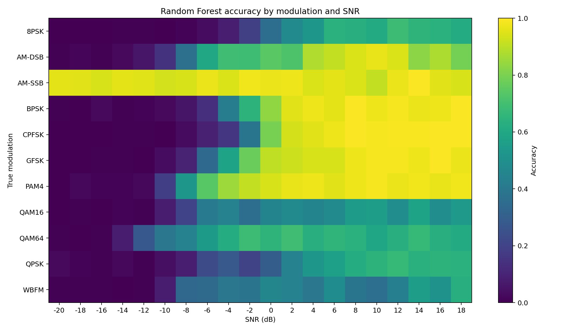
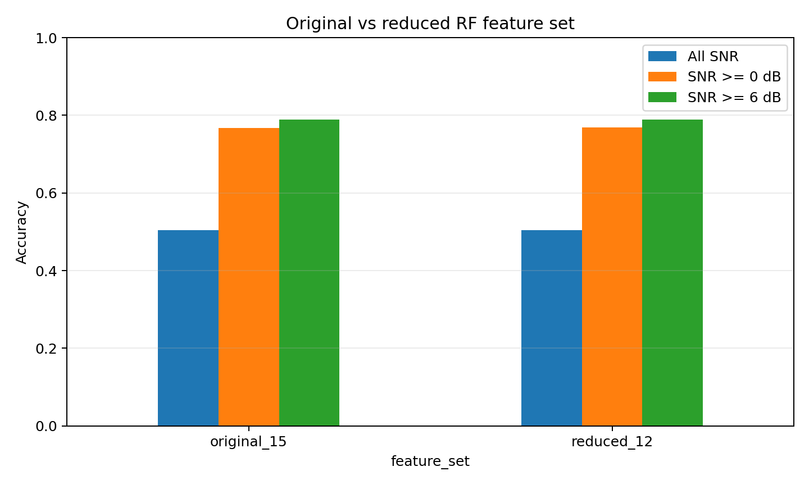

# RadioML modulation classifier

[](https://github.com/chandranshu7/radioml-classifier/actions/workflows/tests.yml)


An interpretable automatic modulation classification baseline for RadioML 2016.10a.
The project follows one complete path:

```text
I/Q samples → RF feature extraction → modulation classifier → SNR analysis
                                      ↘ anomaly detection → inference/dashboard
```

No neural networks are used. The emphasis is on RF reasoning, controlled experiments,
and conclusions supported by saved evaluation artifacts.



## Key findings

- The full Random Forest reaches **50.44% accuracy across all 20 SNR levels**.
- Accuracy is approximately chance at −20 dB and rises to **79.14% at 18 dB**.
- For SNR ≥ 6 dB, Random Forest accuracy is **78.86%**.
- Spectral entropy and spectral bandwidth are the two most-used features.
- Removing three redundant features preserves accuracy: **50.44% → 50.40%**.
- A **2.4 MB demo model** retains 49.10% overall and 77.27% at SNR ≥ 6 dB.
- Isolation Forest detects strong noise and amplitude changes, but not a pure frequency
  translation. That negative result is documented rather than hidden.

With 11 balanced classes, chance accuracy is 9.09%. The 50.44% aggregate result is
heavily affected by examples below −10 dB, where the modulation structure is largely
buried by noise.



## Why this project exists

RadioML examples contain 128 complex baseband samples represented as separate I and Q
channels. This project converts each `(2, 128)` window into 15 measurements describing:

- amplitude and power;
- phase spread;
- I/Q variation and correlation;
- spectral centroid, bandwidth, entropy, and peak magnitude;
- amplitude-distribution kurtosis.

Logistic Regression provides a linear baseline. Random Forest is the main classifier
because it can learn nonlinear thresholds and interactions while remaining inspectable.
SNR is never passed into the models; it is retained only for evaluation.

## Results

The fixed 80/20 split is stratified by the combined `(modulation, SNR)` label:

| Model | All SNRs | SNR ≥ 0 dB | SNR ≥ 6 dB |
|---|---:|---:|---:|
| Logistic Regression | 44.45% | 66.55% | 69.29% |
| Random Forest | **50.44%** | **76.68%** | **78.86%** |

The high-SNR plateau shows the main limitation of the current representation: global
summary features discard symbol ordering, phase transitions, and time-local frequency
behavior. Related classes such as QPSK/8PSK and QAM16/QAM64 therefore remain difficult
even after noise becomes less dominant.



### Reduced-feature experiment

The controlled experiment removes:

- `mean_amplitude` — nearly constant because the dataset is normalized;
- `rms_amplitude` — redundant with `mean_power`;
- `amplitude_variance` — redundant with `std_amplitude`.

| Feature set | Features | All SNRs | SNR ≥ 0 dB | SNR ≥ 6 dB | Model size |
|---|---:|---:|---:|---:|---:|
| Original | 15 | 50.44% | 76.68% | 78.86% | 177.5 MB |
| Reduced | 12 | 50.40% | **76.82%** | **78.92%** | 173.7 MB |

The reduced set is simpler with essentially unchanged performance. This confirms that
redundancy was not the cause of the accuracy ceiling; richer temporal features are the
next justified improvement.



## Run the dashboard

The dashboard works immediately after dependency installation. Its default mode uses a
small bundled signal gallery, the compact classifier, and the anomaly detector—no
dataset download or model training is required.

```bash
git clone https://github.com/chandranshu7/radioml-classifier.git
cd radioml-classifier
python3 -m venv .venv
source .venv/bin/activate
python -m pip install -r requirements.txt
streamlit run app.py
```

Use **Full RadioML dataset** in the sidebar after rebuilding the complete pipeline.

## Try the compact model from the command line

The repository includes [`demo/demo_classifier.joblib`](demo/demo_classifier.joblib),
a 2.4 MB Random Forest trained on the reduced feature set. It provides a lightweight,
reproducible inference path and is not the primary reported model.

```bash
git clone https://github.com/chandranshu7/radioml-classifier.git
cd radioml-classifier

python3 -m venv .venv
source .venv/bin/activate
python -m pip install -r requirements.txt

python scripts/run_demo.py /path/to/RML2016.10a_dict_optimized.pkl \
  --modulation QPSK --snr 18 --sample-index 0
```

Expected output for that example:

```text
True modulation: QPSK
Predicted modulation: QPSK
Confidence: approximately 0.37
```

The artifact was produced with scikit-learn 1.6.1, which is pinned in
`requirements.txt` for compatibility.

## Rebuild the full pipeline

Set the path to a trusted RadioML pickle:

```bash
export RADIOML_DATASET="/path/to/RML2016.10a_dict_optimized.pkl"
```

Then run each step in dependency order:

```bash
python scripts/explore.py "$RADIOML_DATASET"
python scripts/build_features.py "$RADIOML_DATASET"
python src/train.py
MPLBACKEND=Agg python src/evaluate.py
MPLBACKEND=Agg python src/anomaly.py "$RADIOML_DATASET"
python src/inference.py "$RADIOML_DATASET" \
  --modulation QPSK --snr 18 --sample-index 0
```

Run the controlled feature experiment and rebuild the demo artifact with:

```bash
MPLBACKEND=Agg python scripts/compare_feature_sets.py
python scripts/train_demo_model.py
```

## Automated tests

The tests do not require the RadioML dataset or trained model artifacts.

```bash
python -m pip install -r requirements-dev.txt
pytest -q
```

Current coverage includes:

- loader validation and dataset summaries;
- agreement between batch and single-signal feature extraction;
- finite output for degenerate zero signals;
- shape validation and variable-length feature windows;
- inference rejection of invalid shape, NaN, infinity, and invalid SNR.

GitHub Actions runs the suite on every push and pull request.

## Repository layout

```text
.
├── app.py
├── demo/                    # compact downloadable classifier
├── scripts/
│   ├── explore.py
│   ├── build_features.py
│   ├── compare_feature_sets.py
│   ├── train_demo_model.py
│   └── run_demo.py
├── src/
│   ├── data_loader.py
│   ├── features.py
│   ├── train.py
│   ├── evaluate.py
│   ├── anomaly.py
│   └── inference.py
├── tests/
├── results/
├── data/                    # ignored raw/processed data
└── models/                  # ignored full-size artifacts
```

## Limitations

- RadioML is synthetic; these results do not establish over-the-air performance.
- Very low-SNR examples are close to statistically indistinguishable under the current
  128-sample summary representation.
- Random Forest confidence is not calibrated.
- Impurity feature importance is not a causal explanation and is affected by correlated
  predictors.
- The anomaly experiment uses controlled perturbations rather than a labeled operational
  anomaly dataset.
- Pickle files can execute code while loading. Use only a dataset you trust.

## Next experiment

The next improvement should add a small number of interpretable temporal measurements:

- phase-difference statistics;
- instantaneous-frequency statistics;
- low-lag complex autocorrelation;
- selected higher-order complex moments.

Those features directly target the remaining QPSK/8PSK, QAM16/QAM64, and WBFM errors
without changing the project into a deep-learning system.
